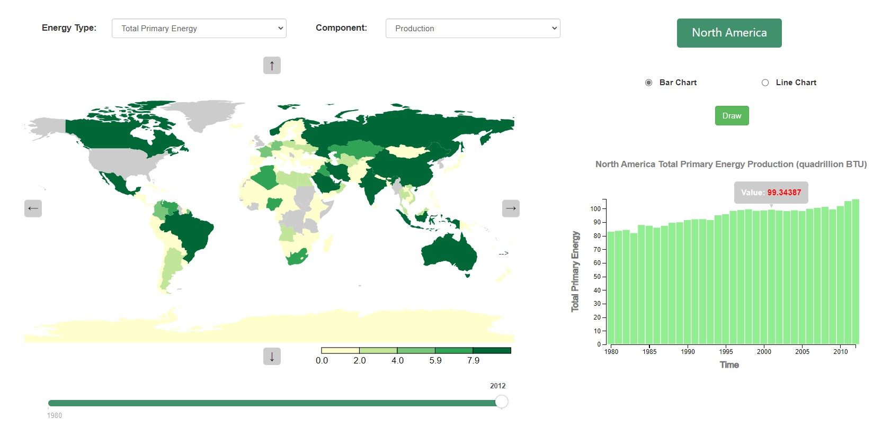

# World-Energy-Consumption-Visualisation
A visualisation of the world's energy I made using D3 library.

## Screenshot

The purpose of this visualisation is to compare the consumption and production of various types of energy across the globe from 1980 to 2012. 

### The website will let users:
* Easily compare the energy amount of each country in each year
* Select between different types of energy to display
* Select between energy production and consumption
* Observe each country’s fluctuation over time by the bar chart or line chart
